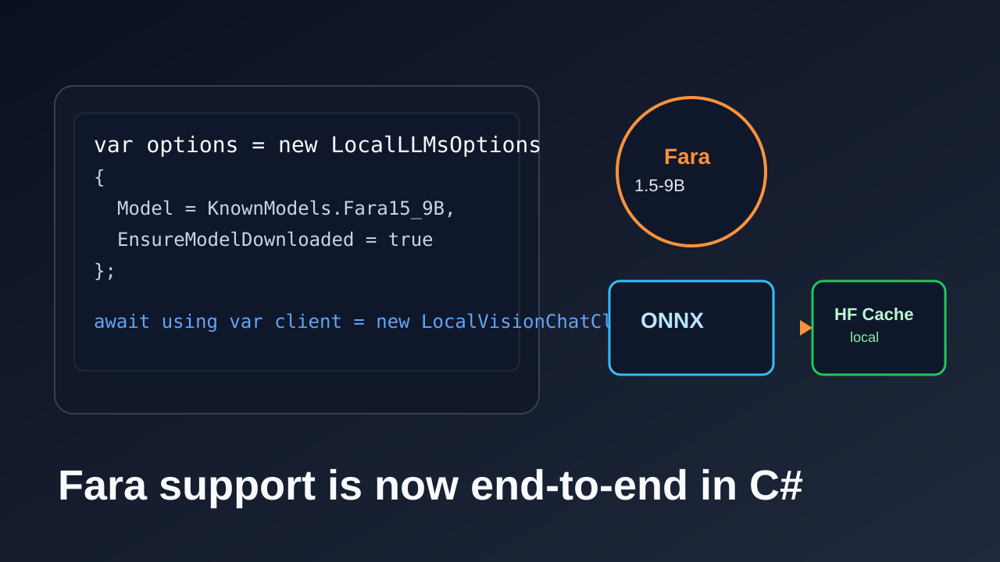
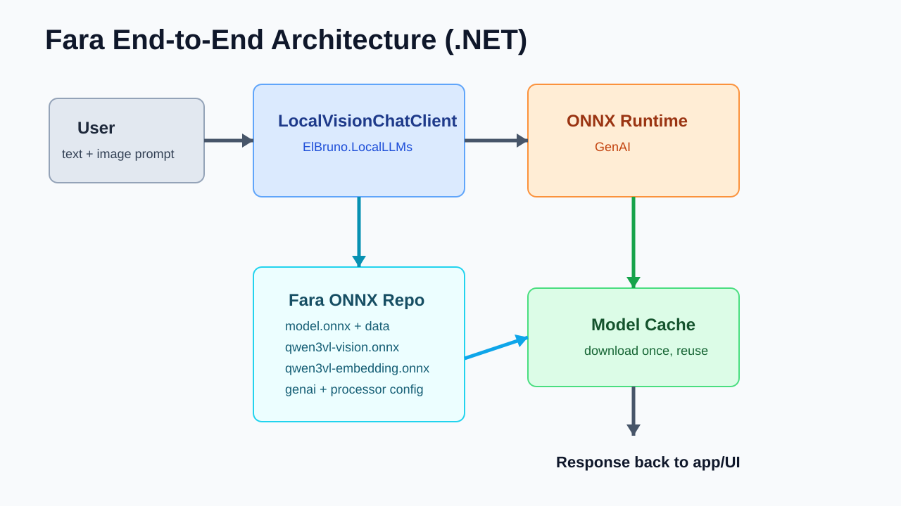
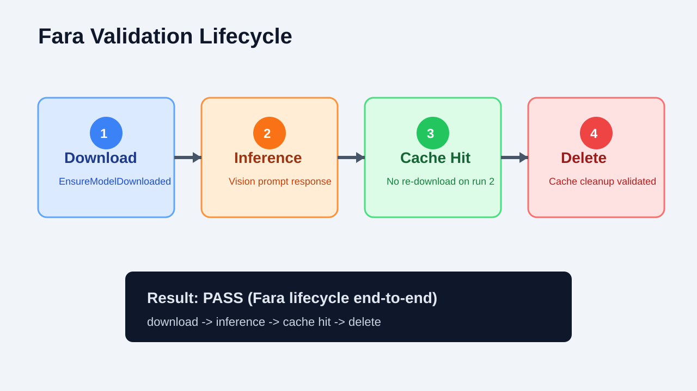

# 🚀 Fara 1.5-9B Is Now Fully Supported in ElBruno.LocalLLMs

## TL;DR

- `Fara1.5-9B` now works end-to-end in **C#** with `ElBruno.LocalLLMs`.
- The validated multimodal ONNX package is published at:
  - https://huggingface.co/elbruno/Fara1.5-9B-onnx
- You can run image+text inference locally with `LocalVisionChatClient` and `KnownModels.Fara15_9B`.
- This closes the loop for end-to-end local agent experiences in:
  - https://github.com/elbruno/ElBruno.MagenticUI



---

When Microsoft Research introduced **MagenticLite, MagenticBrain, and Fara1.5**, it made a strong case for practical local agentic experiences:

- Original announcement:
  - https://www.microsoft.com/en-us/research/blog/magenticlite-magenticbrain-fara1-5-an-agentic-experience-optimized-for-small-models/

In plain words: smaller, specialized models can deliver real agentic behavior when the tooling is right.

For this repo, that “tooling is right” moment means: **Fara is now actually runnable end-to-end in .NET**, not just listed as an idea.

---

## Why this matters for C# end-to-end

The goal of `ElBruno.LocalLLMs` is to make local model usage feel native in .NET. With Fara support in place:

1. You can auto-download the model from Hugging Face.
2. Run vision prompts with `LocalVisionChatClient`.
3. Keep everything in a C# workflow without external service dependencies.

That is especially important for app-level experiences like:

- https://github.com/elbruno/ElBruno.MagenticUI

where “agent loop + UI + model inference” should stay coherent in one stack.



---

## Basic usage: Fara in C#

### 1. Install

```bash
dotnet add package ElBruno.LocalLLMs --version 0.20.3
```

### 2. Minimal Fara vision client

```csharp
using ElBruno.LocalLLMs;
using Microsoft.Extensions.AI;

var options = new LocalLLMsOptions
{
    Model = KnownModels.Fara15_9B,
    EnsureModelDownloaded = true,
    ExecutionProvider = ExecutionProvider.Cpu
};

await using var client = new LocalVisionChatClient(options);
```

### 3. Ask Fara about an image

```csharp
var response = await client.GetResponseAsync(
[
    new ChatMessage(ChatRole.User, "Describe the image in one sentence.")
],
new VisionChatOptions
{
    ImagePaths = [@"C:\images\screen.png"],
    MaxOutputTokens = 64
});

Console.WriteLine(response.Text);
```

---

## Reusing existing Fara sample code

Fara-specific sample code is already in the repo:

- [`src/samples/FaraVisionAgent`](../../src/samples/FaraVisionAgent)

This sample already covers:

- auto-download from `elbruno/Fara1.5-9B-onnx`
- local `--model-path` override
- `--image-path` flow with `VisionChatOptions`

If you want to start from runnable code instead of snippets, use that sample first.

---

## Validation snapshot

Focused validation for Fara support passed:

- Fara unit tests: **39/39**
- Fara Hugging Face checks: **3/3**
- Fara vision lifecycle E2E: **pass**
  - download -> inference -> cache hit -> delete

Detailed report:

- [`docs/tests/2026-07-28-15-run-results.md`](../tests/2026-07-28-15-run-results.md)
- Issue tracking (closed): https://github.com/elbruno/ElBruno.LocalLLMs/issues/35



---

## Relevant links

- NuGet: https://www.nuget.org/packages/ElBruno.LocalLLMs
- Repo: https://github.com/elbruno/ElBruno.LocalLLMs
- Fara ONNX package: https://huggingface.co/elbruno/Fara1.5-9B-onnx
- Microsoft announcement:
  - https://www.microsoft.com/en-us/research/blog/magenticlite-magenticbrain-fara1-5-an-agentic-experience-optimized-for-small-models/
- MagenticUI .NET app:
  - https://github.com/elbruno/ElBruno.MagenticUI

---

Happy coding! 🤖
