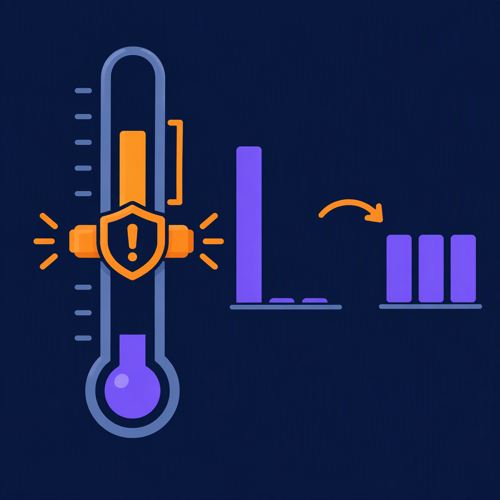

# ⚡ I Stopped Asking an LLM "Which Team Owns This Ticket?" — Now I Get an Answer in 600ms, Locally


⚠️ _This blog post was created with the help of AI tools. The geeky fun and the 🤖 in C# are 100% mine._

---

## TL;DR

I added **`ElBruno.LocalLLMs.Decisions`** to the library (shipped in **v0.22.0**). It runs the **[Laya](https://github.com/NandhaKishorM/laya)** decision model family **locally, in-process, on ONNX Runtime**. No Python. No server. No API key. 🟢

- **Typed answers**, not prose: `choice`, `score`, and yes/no — each with a **full probability distribution**.
- **One forward pass.** Asking 4 questions costs about what asking 1 costs. Measured: **~590 ms for 4 questions.**
- **Non-autoregressive.** It doesn't *generate* an answer token by token. It reads your text once and reads the probabilities straight off the output.
- **Honest warning up front:** the public checkpoints are **not reliably calibrated**. The ranking is good. The confidence *number* needs your own validation. I'll show you exactly where it breaks. 🔴

```bash
dotnet add package ElBruno.LocalLLMs.Decisions
```

---

## The problem: I was using a sledgehammer to answer a yes/no question

Here's the thing I kept doing, and I bet you do it too.

I have a support ticket. I want to know which team should get it. So I call a chat model:

> "You are a helpful classifier. Given the following ticket, respond with exactly one of: billing, technical, sales. Respond with only the word, no explanation. Ticket: ..."

And then I pray. Because what comes back might be `billing`. Or `Billing`. Or `"billing"`. Or `Based on the content, this appears to be a billing issue.` Or, my personal favourite, a beautifully formatted markdown table explaining its reasoning when I explicitly asked for one word. 😅

So I write a parser. Then I write a retry. Then I write a fallback. And all of that is wrapped around a model that is **generating text token by token** to tell me one of three things I already knew the shape of.

That's **System Two** thinking — slow, deliberate, sequential — used for a **System One** job.

System One is the fast one. It's the "that's a snake" reflex before your brain says the word *snake*. Recognition, not reasoning. And when your job is "put this in one of three buckets," recognition is all you need.

That's exactly what Laya is built for.

---

## What "one forward pass" actually means


A normal LLM answering your question does this:

```
read prompt → predict token → append → predict token → append → ... → stop
```

Every token is another trip through the network. That's why latency scales with how much it decides to say.

Laya does this:

```
read prompt (with [MASK] markers where the answers go) → ONE pass → read probabilities
```

The answer positions are marked in the input. After a single pass, the probabilities for every one of your questions are sitting right there in the output tensor. There's no sampling, no temperature roulette, no "it decided to be chatty today."

Which means **batching is nearly free**. Four questions get four sets of markers in the same sequence, and you still pay for one pass.

---

## Show me the code

Minimal version — one question:

```csharp
using ElBruno.LocalLLMs.Decisions;

using var client = new LayaOnnxDecisionClient();

var result = await client.ChooseAsync(
    "My invoice charged me twice for the same subscription month and I want my money back.",
    new[] { "billing", "technical", "sales" },
    "Which team should handle this support ticket?");

Console.WriteLine(result.Choice);        // billing
Console.WriteLine(result.Probability);   // 0.984
```

First run downloads the model from HuggingFace (**~800 MB**) and caches it. Every run after that is local and offline.

### Option descriptions matter more than you'd think

This is the single highest-leverage thing in the whole API, and it's easy to miss. Instead of bare labels, pass a dictionary with **descriptions**:

```csharp
var teams = new Dictionary<string, string?>
{
    ["billing"]   = "Payment, invoice and refund problems",
    ["technical"] = "Bugs, outages, API errors and anything with a stack trace",
    ["sales"]     = "Pricing, plan comparisons, upgrades and new purchases"
};
```

The word `technical` on its own is nearly meaningless to a classifier. *"Bugs, outages, API errors and anything with a stack trace"* gives it something to actually match against. The accuracy difference is not subtle. 🎯

### The real thing: 4 questions, 1 pass

```csharp
var result = await client.EvaluateAsync(
    new DecisionRequest(ticket)
        .Choose("team", teams, "Which team should handle this support ticket?")
        .Score("urgency", urgencyLevels, "How urgent is this ticket?")
        .Ask("refund", "The customer is asking for a refund.")
        .Ask("angry",  "The customer is angry or frustrated."));

ChoiceResult      team    = result.Choice("team");
ScoreResult       urgency = result.Score("urgency");
ProbabilityResult refund  = result.Probability("refund");
ProbabilityResult angry   = result.Probability("angry");

// Gate on the probability, not the label — so ambiguous tickets go to a human
// instead of being confidently misrouted.
string route = team.ChoiceOrNull(0.6) ?? "human-review";
```

Here's the **actual output** from the [`LocalDecisions` sample](../../src/samples/LocalDecisions/) on my machine:

```
------------------------------------------------------------------------------
My invoice charged me twice for the same subscription month and I want my m…

  route   : billing        (billing @ 98.4%)
  urgency : urgent, answer within an hour
            score 1.67 of 3
  refund  : yes  (p = 0.940)
  angry   : yes  (p = 0.768)

  distribution: billing 98%  sales 1%  technical 1%
  244 input tokens, 586 ms, model 'elbruno/laya-onnx'
------------------------------------------------------------------------------
The export endpoint returns a 500 every time I pass more than 50 ids. Here …

  route   : technical      (technical @ 73.7%)
  urgency : urgent, answer within an hour
            score 1.82 of 3
  refund  : no   (p = 0.412)
  angry   : no   (p = 0.002)

  distribution: technical 74%  billing 15%  sales 11%
  260 input tokens, 595 ms, model 'elbruno/laya-onnx'
------------------------------------------------------------------------------
Hi! Just wondering what the difference is between the Pro and Team plans be…

  route   : sales          (sales @ 64.9%)
  urgency : normal, answer within a day
            score 0.94 of 3
  refund  : no   (p = 0.000)
  angry   : no   (p = 0.000)

  distribution: sales 65%  billing 20%  technical 15%
  248 input tokens, 526 ms, model 'elbruno/laya-onnx'
```

Look at that middle one. `refund: no (p = 0.412)` — the model is genuinely unsure, and it *tells me* it's unsure. A chat model would have just said "no" with total conviction. Having the number is the whole point. 📊

And `angry: p = 0.002` on the stack-trace ticket versus `0.768` on the double-billing one. That's a sentiment signal I got **for free**, in the same pass, because I asked.

---

## Now the part where I'm honest with you 🔴



I could stop the post here and it would be a nice launch announcement. But I ran into something while building this that you need to know about, because it would absolutely bite you in production.

**Laya's public checkpoints are not reliably calibrated.**

Laya fits a separate *temperature* for each `(question type, option count)` bucket — `choice:2`, `choice:3-5`, `choice:6-10`, `choice:11+`. That temperature divides the logits before the softmax.

The English checkpoint ships **`choice:11+ = 0.1006`**.

Laya's own code says the minimum valid temperature is `0.5`. Dividing by `0.1006` multiplies the logits roughly **tenfold** before the softmax — which flattens every distribution into a spike at whatever won.

So this package clamps it to `0.5` and — this is the important bit — **tells you it did**:

```csharp
var result = await client.ChooseAsync(ticket, twelveDepartments, "Route this ticket");

if (result.CalibrationClamped)
{
    // The ranking is still meaningful. The confidence number is not.
    logger.LogWarning("Confidence for {Choice} is not a fitted calibration.", result.Choice);
}
```

It's a **per-answer** flag, not a global one, because a single checkpoint can have perfectly good temperatures for some buckets and garbage for others.

### But here's what the clamp does *not* buy you

I wrote in the docs, at first, that clamping "keeps the number honest." Then I actually ran it, and I was wrong. So I went back and fixed the docs — and the HuggingFace model card. 😬

Same ticket, same model, only the number of options changes:

| Options | Bucket | Choice | Reported confidence | `CalibrationClamped` |
|---|---|---|---|---|
| 5 | `choice:3-5` | `billing` | 86.9% | `false` |
| 12 | `choice:11+` | `billing` | **100.0%** | `true` |

Both picked the **right** department. But the 12-option answer reports **100.0% confidence** — *after* clamping. Because `0.5` still doubles the logits. Clamping prevents the catastrophic tenfold sharpening; it does not give you a calibrated number.

What that means in practice:

- ✅ **Use the ranking.** `Choice` and the relative order of `Probabilities` are trustworthy.
- 🔴 **Don't use the magnitude** for choices with 11+ options.
- 🔴 **`ChoiceOrNull(threshold)` will never abstain** in that bucket — a saturated probability clears every threshold you'd plausibly set.
- ✅ **Prefer fewer options.** Splitting one 12-way choice into two smaller ones keeps you in a bucket the checkpoint actually fitted correctly.

### The fp16 gotcha

One more, smaller one. The checkpoint stores **fp16** weights. Ask a question alone vs. batched with three others and you get *slightly* different numbers, because batched matrix multiplications accumulate in a different order:

| Label | Alone | Batched with 3 others | Delta |
|---|---|---|---|
| `billing` | 0.93738423 | 0.93739642 | 1.22e-05 |
| `sales` | 0.03319702 | 0.03318152 | 1.55e-05 |
| `technical` | 0.02941875 | 0.02942205 | 3.31e-06 |

Deltas land around `1e-6` to `1e-4`. Way too small to flip a routing decision. But big enough to ruin your day if you **assert exact equality in tests** (use a `1e-3` tolerance), **cache on the probability value** (key on the label instead), or **hash results for change detection** (round first).

Batching is still the right default. Just don't treat the low decimals as stable.

---

## What I had to build to make this work in .NET

There was no ONNX build of Laya when I started. There is now — I ported one and published it as **[`elbruno/laya-onnx`](https://huggingface.co/elbruno/laya-onnx)** (mirroring the Apache-2.0 original).

The .NET side had to reimplement, faithfully, what the Python reference does:

| Piece | What it does |
|---|---|
| **Tokenizer** | `Microsoft.ML.Tokenizers` — no Python tokenizer bridge |
| **Sequence builder** | Lays out the prompt with `[MASK]` markers at every answer position |
| **Temperature config** | Reads the per-bucket fitted temperatures — and clamps the invalid ones |
| **Decode math** | Pulls logits at the marker offsets, applies temperature, softmaxes |
| **Runtime** | `Microsoft.ML.OnnxRuntime`, in-process, CPU |

The whole thing is covered by **79 tests**, including parity checks against the reference outputs — because "I ported the math correctly" is a claim that deserves evidence, not vibes. 🧪

Wiring it into DI is one line:

```csharp
builder.Services.AddLocalDecisions();
```

---

## When to use this (and when not to)

**Reach for it when:**

- You're classifying, routing, triaging, moderating, or scoring 📥
- You need the answer **fast** and **cheap** and **offline**
- You want a **probability**, not a sentence
- You're asking the same shaped question thousands of times

**Don't reach for it when:**

- You need something written, summarised, or explained
- The task genuinely needs multi-step reasoning
- You need calibrated confidence over 11+ options and can't fit your own temperature

It's not a replacement for a chat model. It's the thing you put **in front of** one, so the expensive model only sees the cases that actually need it. 🚦

---

## Getting started

1. **Install:**
   ```bash
   dotnet add package ElBruno.LocalLLMs.Decisions
   ```
2. **Run a sample** — the model downloads and caches on first use:
   ```bash
   dotnet run --project src/samples/LocalDecisions
   ```
3. **See the caveats live:**
   ```bash
   dotnet run --project src/samples/DecisionCalibration
   ```
4. **Fit your own threshold** on your own labelled data. The `0.5` default is a starting point, not a decision boundary.

---

## What's next

- Surfacing the **escalation head** (`act_logits`) — Laya has a signal for "this needs a human" that I read but don't expose yet
- **int8** export and a proper benchmark against the fp16 one
- **Multilingual checkpoints** — the English one stays confident on non-Latin scripts while being wrong, which is the worst combination

---

Building this changed how I think about where LLMs belong in an app. Not every question deserves a conversation. Some questions just need an answer, in 600 milliseconds, on your own machine, with a number attached so you know how much to trust it.

And honestly? Finding that `0.1006` temperature — and then discovering my own fix didn't fully fix it — was the most fun part. That's the difference between shipping a wrapper and shipping something you've actually *looked inside*. 🤖

**— Bruno**

---

📌 _Full guide: [Decisions Guide](../decisions-guide.md) · Samples: [LocalDecisions](../../src/samples/LocalDecisions/) · [DecisionCalibration](../../src/samples/DecisionCalibration/) · Model: [elbruno/laya-onnx](https://huggingface.co/elbruno/laya-onnx) · Original: [NandhaKishorM/laya](https://github.com/NandhaKishorM/laya)_

*Made with ❤️ by [Bruno Capuano (ElBruno)](https://elbruno.com)*
