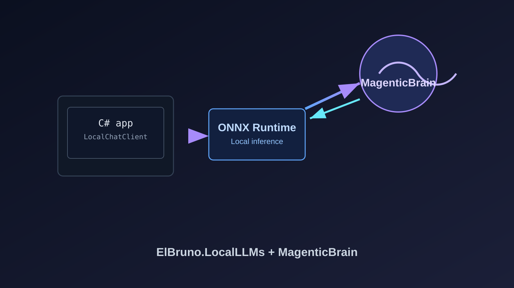
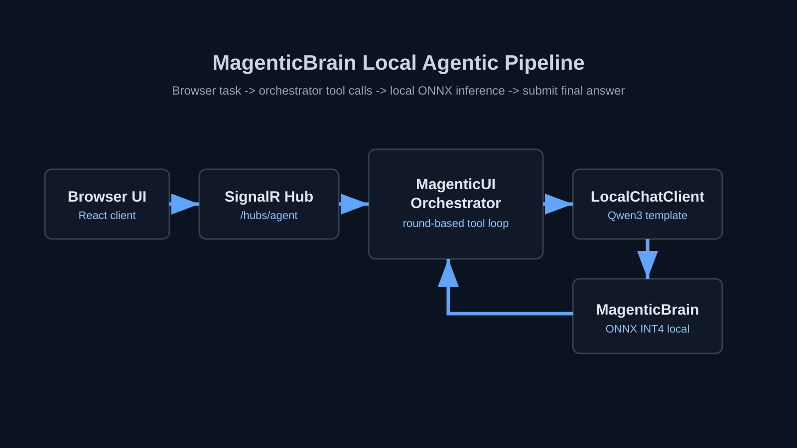
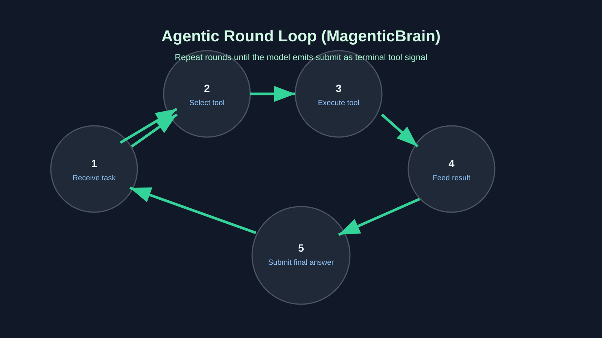
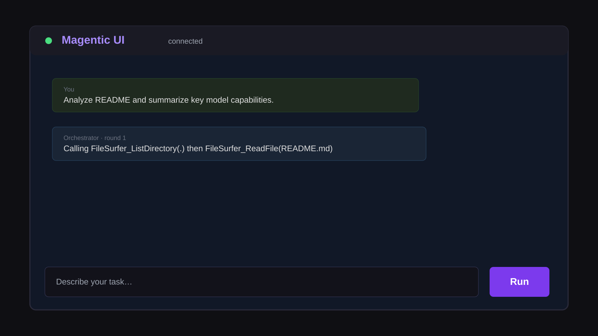
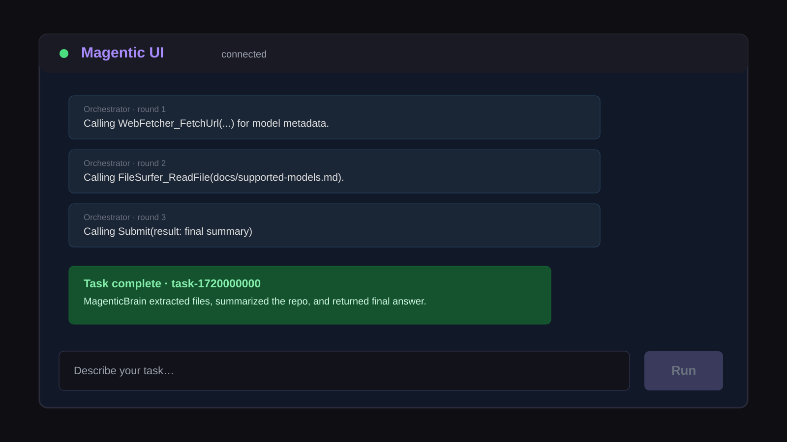

# 🧠 MagenticBrain Is Now Supported in ElBruno.LocalLLMs

## TL;DR

- `KnownModels.MagenticBrain` is now ready for local .NET usage with `ElBruno.LocalLLMs`.
- ONNX package is available at:
  - https://huggingface.co/elbruno/MagenticBrain-onnx
- Original model source:
  - https://huggingface.co/microsoft/MagenticBrain
- This support is designed to power end-to-end agentic app experiences such as:
  - https://github.com/elbruno/ElBruno.MagenticUI



---

## Why this model is important (and what it is designed for)

`MagenticBrain` is not just another general-purpose chat model. It is designed for **agent orchestration**: planning multi-step tasks, selecting tools, chaining tool calls across rounds, and deciding when to terminate with a final answer.

That design matters because many app scenarios need more than one prompt/one response:

- file + web research workflows
- iterative tool usage with state between turns
- “do the task, then submit result” orchestration patterns

In short, MagenticBrain is built for **agentic execution loops**, which is why it is a strong fit for `.NET + LocalChatClient + MagenticUI` experiences.

---

When Microsoft Research introduced **MagenticLite, MagenticBrain, and Fara1.5**, they framed a practical path for local agentic workflows:

- Official post:
  - https://www.microsoft.com/en-us/research/blog/magenticlite-magenticbrain-fara1-5-an-agentic-experience-optimized-for-small-models/

For this repo, this post marks the concrete implementation milestone: **MagenticBrain is now a first-class supported model in `ElBruno.LocalLLMs`**.

---

## Why this matters for MagenticUI scenarios

The target is a clean .NET workflow where orchestration and model inference stay in the same stack:

1. Use `KnownModels.MagenticBrain` in `LocalChatClient`.
2. Keep tool-calling and multi-round logic in C#.
3. Reuse the same model path for local multi-agent UX in MagenticUI-style applications.

This is exactly the scenario behind:

- https://github.com/elbruno/ElBruno.MagenticUI



---

## Basic usage: MagenticBrain in C#

### 1. Install

```bash
dotnet add package ElBruno.LocalLLMs --version 0.20.4
```

### 2. Create a local MagenticBrain client

```csharp
using ElBruno.LocalLLMs;
using Microsoft.Extensions.AI;

var options = new LocalLLMsOptions
{
    Model = KnownModels.MagenticBrain,
    EnsureModelDownloaded = true,
    Temperature = 0.7f,
    MaxSequenceLength = 32768
};

using var client = await LocalChatClient.CreateAsync(options);
```

### 3. Use it in an agentic loop with tools

```csharp
var response = await client.GetResponseAsync(
[
    new ChatMessage(ChatRole.System, "You are an agentic assistant. Use tools and call submit when done."),
    new ChatMessage(ChatRole.User, "List project files and summarize README.")
],
new ChatOptions
{
    Tools = tools
});
```



---

## Repo samples you can run now

- [`src/samples/MagenticBrainAgent`](../../src/samples/MagenticBrainAgent)
  - OmniAgent-style round loop, tool calls, and `submit` stop-signal.
- [`src/samples/MagenticUIServer`](../../src/samples/MagenticUIServer)
  - Local multi-agent web sample with SignalR + React UI.
- [`docs/magentic-ui-dotnet.md`](../magentic-ui-dotnet.md)
  - Architecture and setup details for MagenticUI .NET flow.

No extra sample project is required for this post: the existing MagenticBrain and MagenticUI samples already cover the runnable story.

---

## Sample app screenshots (MagenticUIServer)

The following screenshots illustrate the sample app flow using the Magentic UI client and agent stream model:





You can run the sample from:

- [`src/samples/MagenticUIServer/MagenticUIServer`](../../src/samples/MagenticUIServer/MagenticUIServer)
- [`src/samples/MagenticUIServer/MagenticUIServer/ClientApp`](../../src/samples/MagenticUIServer/MagenticUIServer/ClientApp)

---

## Relevant links

- NuGet: https://www.nuget.org/packages/ElBruno.LocalLLMs
- Repository: https://github.com/elbruno/ElBruno.LocalLLMs
- Supported models reference:
  - https://github.com/elbruno/ElBruno.LocalLLMs/blob/main/docs/supported-models.md
- Auto-download guide:
  - https://github.com/elbruno/ElBruno.LocalLLMs/blob/main/docs/auto-download.md
- Official Microsoft announcement:
  - https://www.microsoft.com/en-us/research/blog/magenticlite-magenticbrain-fara1-5-an-agentic-experience-optimized-for-small-models/
- Original MagenticBrain model:
  - https://huggingface.co/microsoft/MagenticBrain
- Published ONNX package used by this repo:
  - https://huggingface.co/elbruno/MagenticBrain-onnx
- MagenticUI app:
  - https://github.com/elbruno/ElBruno.MagenticUI

---

Happy coding! 🤖
